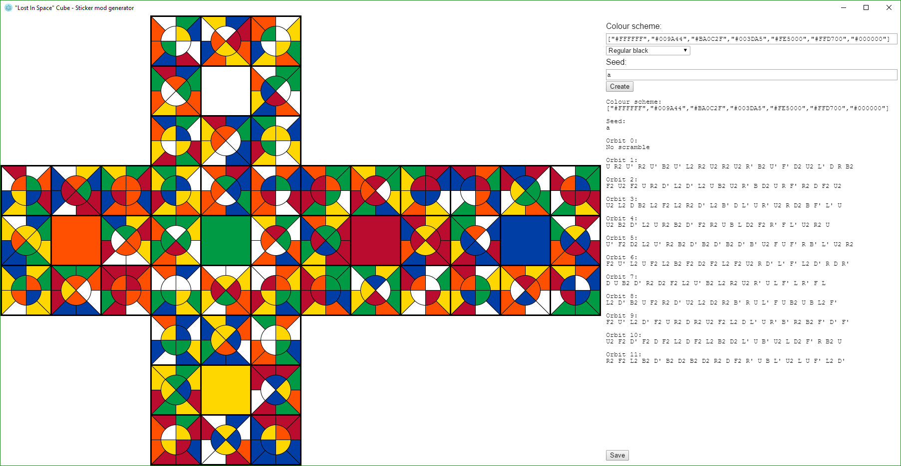

# Lost In Space

This project generates sticker patterns for the Rubik's Cube "Lost In Space" mod.

See [instructions.md](instructions.md) for details about the puzzle.

## Using the generator

#### Running

Currently there is no released version. Follow the instructions under the **Development** section to run the project.

#### Colour scheme

The colour scheme is a list of 7 CSS colours in JSON format, in the order [Up, Front, Right, Back, Left, Down, background colour].

You can choose a built-in colour scheme using the dropdown list.

#### Seed

The seed initializes the random number generator used to scramble the stickers. Using the same seed will always result in the same sticker pattern.

Leave the seed input blank to generate a random seed.

#### Create

The Create button generates the sticker pattern using the specified colour scheme and seed.

The output of the generator is displayed below it.

#### Save

The Save button saves the following files to your user directory under "Lost In Space":

- A high-resolution image of the sticker pattern
- The original image of the sticker pattern
- The output of the generator, including the seed and colour scheme used.

## Development

Clone:

	git clone https://github.com/kendfrey/lostinspacecube.git

Install dependencies:

	npm install

Build:

	make

Run:

	electron .

If you open the project in VSCode, you can also press F5 to build and run.
