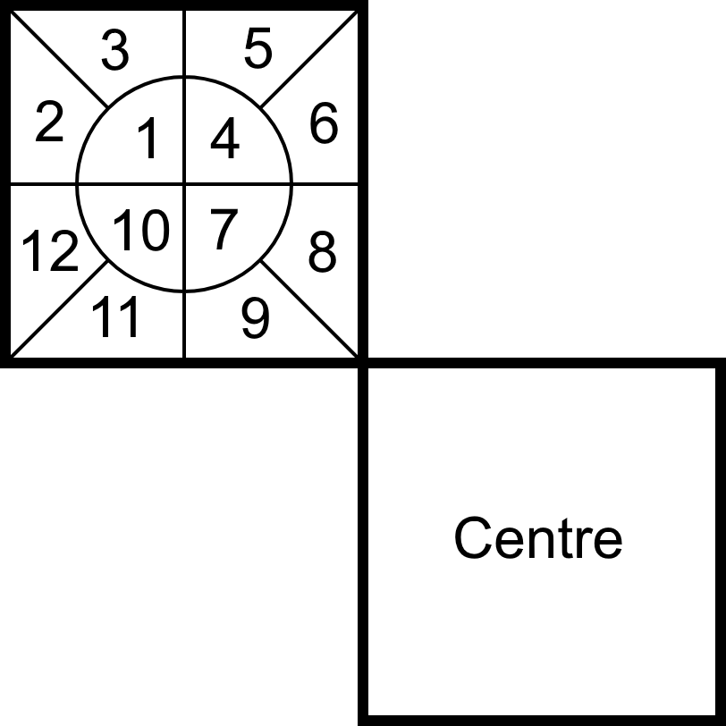
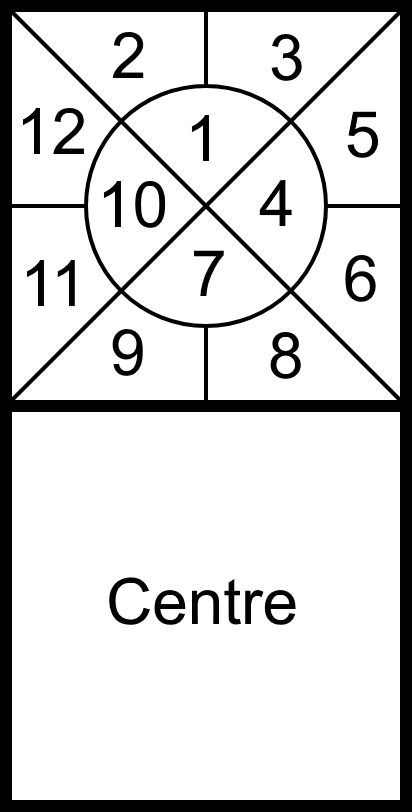

# "Lost In Space" Cube

### What is it?

"Lost In Space" is a sticker mod for the 3x3x3 Rubik's Cube. It is a multi-solution cube, which means that there are effectively several cubes in one, and each has its own solved state.

### How does it work?

Most experienced cubers know that if you assemble the pieces of a Rubik's Cube randomly, you won't always get a solvable cube. Most of the time, you will end up with a corner twist, a flipped edge, two swapped edges, or some combination of these three problems. In fact, there are 12 different possible results, known as "orbits", and only one of those results in a solvable cube.

Lost In Space is the solution to that. This cube has 12 solved states, one in each orbit. This means if you assemble the cube randomly, there will always be exactly one solution available. The other 11 solutions will not be reachable by only turning the faces of the cube.

### How do I read the cube?

The stickers are divided into 12 cells, one for each orbit. The orbits are arranged in relation to the centre of each face. Here are the mappings for corner and edge stickers.

Corners:

Edges:

For example, orbit 1 is always the quarter of the middle circle that is farthest from the centre, and orbits 8 and 9 are the two nearest cells to the centre.

The orbits are arranged as follows: 

- Orbit 1 represents the original orbit, with no pieces out of position.
- Orbits 2 and 3 are the same as orbit 1, but with a clockwise and counter-clockwise corner twist respectively.
- Orbits 4-6 are the same as orbits 1-3, but with one edge flipped.
- Orbits 10-12 are the same as orbits 1-3, but with two edges swapped (or equivalently, two corners swapped).
- Orbits 7-9 are the same as orbits 1-3, but with two edges swapped and one edge flipped.

For example:

- If you try to solve orbit 1, but there is a clockwise corner twist and two edges are swapped, the cube is actually in orbit 12.
- If you try to solve orbit 8, but there is a flipped edge, the cube is actually in orbit 11.
- If you try to solve orbit 11, but there is a counter-clockwise corner twist, a flipped edge, and two edges are swapped, the cube is actually in orbit 6.

### How do I scramble it?

The best way to scramble the cube is to disassemble it and then reassemble it randomly.

### How do I solve it?

The first thing you need to do is determine which orbit the cube is in. This can be done in several ways, for example:

- Pick one orbit and try to solve it. If you reach an unsolvable state, look at which pieces are out of position to figure out which orbit the cube is actually in. (The Easy Way)
- Calculate the parity of the scrambled cube before solving. (The Clever Way)

After that, you can solve it just like a regular 3x3x3, using the colours corresponding to the cube's orbit.

### What does the name mean?

If you ever get lost in space, the first step will be to figure out which orbit you're in. That is also the first step to solving this puzzle.

 
 
Source: https://github.com/kendfrey/lostinspacecube/blob/master/instructions.md
